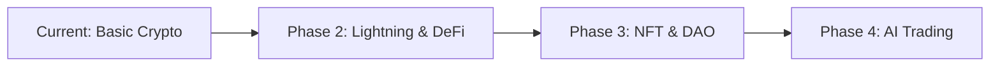

# Cryptocurrency Payment Integration Guide
## Complete Setup and Usage Guide for FacultyFinder

This guide covers the complete implementation of cryptocurrency payments in FacultyFinder, including setup, configuration, usage, and troubleshooting.

---

## 📋 Table of Contents

1. [Overview](#overview)
2. [Supported Cryptocurrencies](#supported-cryptocurrencies)
3. [Payment Providers](#payment-providers)
4. [System Requirements](#system-requirements)
5. [Installation & Setup](#installation--setup)
6. [Configuration](#configuration)
7. [Database Setup](#database-setup)
8. [Environment Variables](#environment-variables)
9. [Testing](#testing)
10. [Production Deployment](#production-deployment)
11. [User Experience](#user-experience)
12. [Admin Management](#admin-management)
13. [Security Considerations](#security-considerations)
14. [Troubleshooting](#troubleshooting)
15. [API Documentation](#api-documentation)

---

## Overview

The FacultyFinder cryptocurrency payment system provides:

### ✅ Key Features
- **Multiple Cryptocurrencies**: Bitcoin, Ethereum, Litecoin, Bitcoin Cash, USDC, USDT, DAI, Polygon, BNB, Dogecoin
- **Multiple Providers**: Coinbase Commerce, NOWPayments, CoinGate, BitPay
- **Real-time Exchange Rates**: Automatic conversion from CAD to crypto amounts
- **QR Code Generation**: Easy mobile wallet scanning
- **Webhook Processing**: Automatic payment confirmation
- **User Privacy**: Anonymous payments for non-registered users
- **Comprehensive Tracking**: Full payment history and status monitoring

### 💰 Payment Options
- Single AI Analysis: $4 CAD
- 3-Analysis Pack: $10 CAD (Most Popular)
- 5-Analysis Pack: $15 CAD (Best Value)
- Monthly Unlimited: $19 CAD
- Expert Review Basic: $29 CAD
- Expert Review Premium: $49 CAD
- VIP Package: $99 CAD

---

## Supported Cryptocurrencies

### 🪙 Main Cryptocurrencies

| Symbol | Name | Network | Type | Confirmation Blocks |
|--------|------|---------|------|-------------------|
| BTC | Bitcoin | Mainnet | Native | 3 |
| ETH | Ethereum | Mainnet | Native | 12 |
| LTC | Litecoin | Mainnet | Native | 6 |
| BCH | Bitcoin Cash | Mainnet | Native | 6 |
| USDC | USD Coin | Ethereum | Stablecoin | 12 |
| USDT | Tether | Ethereum | Stablecoin | 12 |
| DAI | Dai Stablecoin | Ethereum | Stablecoin | 12 |
| MATIC | Polygon | Polygon | Native | 20 |
| BNB | Binance Coin | BSC | Native | 15 |
| DOGE | Dogecoin | Mainnet | Native | 6 |

### 💡 Recommended Currencies

**For Fast Payments:**
- USDC, USDT, DAI (Stablecoins - no volatility)
- MATIC (Low fees, fast confirmations)
- LTC (Fast and reliable)

**For Privacy:**
- BTC (Most anonymous)
- BCH (Lower fees than BTC)

**For Lowest Fees:**
- MATIC, BNB (Network fees under $0.01)
- DOGE (Very low fees)

---

## Payment Providers

### 🏛️ Provider Comparison

| Provider | Fee | Supported Currencies | Features |
|----------|-----|---------------------|----------|
| **Coinbase Commerce** | 1% | BTC, ETH, LTC, BCH, USDC, DAI | Best for beginners, reliable |
| **NOWPayments** | 0.5% | All 10 currencies | Lowest fees, most currencies |
| **CoinGate** | 1% | BTC, ETH, LTC, BCH, USDC, USDT, DOGE | European-focused |
| **BitPay** | 1% | BTC, BCH, ETH, USDC, DAI | Enterprise-grade |

### 📊 Recommended Provider Strategy
1. **Primary**: NOWPayments (lowest fees, most currencies)
2. **Backup**: Coinbase Commerce (most reliable)
3. **Regional**: CoinGate for European users

---

## System Requirements

### 🖥️ Server Requirements
- Python 3.8+
- Flask 2.3+
- SQLite 3.35+ (development) or PostgreSQL 12+ (production)
- 512MB RAM minimum (2GB recommended)
- 10GB storage minimum
- SSL certificate (required for webhooks)

### 📦 Python Dependencies
```bash
pip install cryptography==42.0.8
pip install pycryptodome==3.19.0
pip install qrcode[pil]==7.4.2
pip install websocket-client==1.6.4
```

---

## Installation & Setup

### 1. Install Dependencies

```bash
cd FacultyFinder
pip install -r requirements.txt
```

### 2. Database Migration

```sql
-- Apply new crypto payment tables
sqlite3 database/facultyfinder_dev.db < database/schema.sql

-- Or for PostgreSQL
psql -d facultyfinder_production -f database/schema.sql
```

### 3. Verify Installation

```bash
python -c "
import sys
sys.path.append('webapp')
from crypto_payments import get_crypto_payment_manager
print('✅ Crypto payments module loaded successfully')
"
```

---

## Configuration

### 🔧 Provider Setup

#### Coinbase Commerce Setup

1. **Create Account**: Visit [commerce.coinbase.com](https://commerce.coinbase.com)
2. **Get API Key**:
   ```bash
   # Login to Coinbase Commerce
   # Navigate to Settings > API Keys
   # Create new API key
   ```
3. **Configure Webhooks**:
   - Endpoint: `https://yourdomain.com/webhooks/crypto/coinbase_commerce`
   - Events: Select all charge events
   - Copy webhook secret

#### NOWPayments Setup

1. **Create Account**: Visit [nowpayments.io](https://nowpayments.io)
2. **Get API Key**:
   ```bash
   # Complete KYC verification
   # Navigate to Account > API
   # Generate API key
   ```
3. **Configure IPN**:
   - IPN URL: `https://yourdomain.com/webhooks/crypto/nowpayments`
   - Copy IPN secret

#### CoinGate Setup

1. **Create Account**: Visit [coingate.com](https://coingate.com)
2. **Get API Key**:
   ```bash
   # For sandbox: api-sandbox.coingate.com
   # For production: api.coingate.com
   # Generate API token in settings
   ```

---

## Database Setup

### 📊 Table Structure

The crypto payment system adds these tables:

```sql
-- Core cryptocurrency data
crypto_currencies (10 default currencies)
crypto_payment_providers (4 providers)

-- Payment tracking
crypto_payments (main payment records)
crypto_payment_events (webhook events)
crypto_exchange_rates (rate caching)

-- User preferences
user_crypto_preferences (user settings)
```

### 🔄 Data Population

```sql
-- Sample data is automatically inserted:
-- - 10 cryptocurrencies with current logos and explorer links
-- - 4 payment providers with current endpoints
-- - Proper minimum/maximum amounts for each currency
```

---

## Environment Variables

### 🔐 Required Variables

```bash
# Crypto Payment Configuration
CRYPTO_ENCRYPTION_KEY=your_encryption_key_here

# Coinbase Commerce
COINBASE_COMMERCE_API_KEY=your_coinbase_api_key
COINBASE_COMMERCE_WEBHOOK_SECRET=your_coinbase_webhook_secret

# NOWPayments
NOWPAYMENTS_API_KEY=your_nowpayments_api_key
NOWPAYMENTS_WEBHOOK_SECRET=your_nowpayments_webhook_secret

# CoinGate
COINGATE_API_KEY=your_coingate_api_key
COINGATE_WEBHOOK_SECRET=your_coingate_webhook_secret
COINGATE_SANDBOX=false  # Set to true for testing

# Optional: Enhanced exchange rates
COINAPI_KEY=your_coinapi_key  # For backup exchange rates
```

### 🚀 Production Example

```bash
# .env file for production
BASE_URL=https://facultyfinder.io
CRYPTO_ENCRYPTION_KEY=gAAAAABhZ...encrypted_key_here
COINBASE_COMMERCE_API_KEY=xxxxxxxx-xxxx-xxxx-xxxx-xxxxxxxxxxxx
COINBASE_COMMERCE_WEBHOOK_SECRET=xxxxxxxxxxxxxxxxxxxx
NOWPAYMENTS_API_KEY=XXXXXXXX-XXXX-XXXX-XXXX-XXXXXXXXXXXX
NOWPAYMENTS_WEBHOOK_SECRET=xxxxxxxxxxxxxxxxxxxxx
COINGATE_SANDBOX=false
```

---

## Testing

### 🧪 Test Setup

1. **Use Sandbox Mode**:
   ```bash
   export COINGATE_SANDBOX=true
   export COINBASE_COMMERCE_API_KEY=test_key
   ```

2. **Run Test Suite**:
   ```bash
   python test_crypto_analysis.py
   ```

3. **Test Payment Flow**:
   ```bash
   # Create test payment
   curl -X POST http://localhost:8080/api/crypto/create-payment \
     -H "Content-Type: application/json" \
     -d '{
       "amount_cad": 1000,
       "service_type": "ai_analysis",
       "currency": "BTC",
       "provider": "coinbase_commerce",
       "guest_name": "Test User",
       "guest_email": "test@example.com"
     }'
   ```

### 🔍 Test Scenarios

1. **Currency Loading**: Verify all 10 currencies load correctly
2. **Exchange Rates**: Test real-time rate fetching
3. **Payment Creation**: Create payments with different providers
4. **Webhook Processing**: Simulate webhook events
5. **QR Code Generation**: Verify QR codes generate properly

---

## Production Deployment

### 🚀 Deployment Checklist

#### Pre-Deployment
- [ ] All environment variables configured
- [ ] SSL certificate installed
- [ ] Database schema updated
- [ ] Webhook endpoints accessible
- [ ] Provider accounts verified

#### Security Setup
- [ ] API keys encrypted in database
- [ ] Webhook signature verification enabled
- [ ] Rate limiting configured
- [ ] Error logging enabled
- [ ] Payment monitoring alerts set up

#### Performance Optimization
- [ ] Database indexes created
- [ ] Exchange rate caching enabled
- [ ] Connection pooling configured
- [ ] Static asset compression enabled

### 🔧 Production Configuration

```python
# Production settings
CRYPTO_PAYMENT_CACHE_DURATION = 300  # 5 minutes
EXCHANGE_RATE_CACHE_DURATION = 300   # 5 minutes
MAX_PAYMENT_AMOUNT_CAD = 10000       # $100 CAD
MIN_PAYMENT_AMOUNT_CAD = 100         # $1 CAD
PAYMENT_EXPIRY_MINUTES = 15          # 15 minutes
```

---

## User Experience

### 👤 User Journey

#### For Logged-in Users:
1. Select AI analysis option
2. Choose payment method (crypto vs credit card)
3. Select cryptocurrency and provider
4. See real-time amount calculation
5. Confirm payment creation
6. Get payment page with QR code
7. Send crypto from wallet
8. Automatic confirmation and service delivery

#### For Guest Users:
1. Fill in name and email
2. Same payment flow as logged-in users
3. Payment tracking via email and payment ID

### 📱 Mobile Experience

- **QR Code Scanning**: One-tap payment from mobile wallets
- **Responsive Design**: Works on all screen sizes
- **Real-time Updates**: Auto-refresh payment status
- **Copy Address**: One-tap address copying

### 🔔 Notifications

- **Email Confirmations**: Payment received, completed, failed
- **Status Updates**: Real-time payment status in browser
- **Admin Alerts**: Failed payments, webhook errors

---

## Admin Management

### 👨‍💼 Admin Dashboard Features

#### Payment Monitoring
```python
# Admin can view:
- All crypto payments (real-time)
- Payment success rates by provider
- Exchange rate performance
- Revenue analytics by cryptocurrency
- Failed payment investigation tools
```

#### Provider Management
```python
# Admin controls:
- Enable/disable providers
- Update API keys
- Monitor webhook health
- View provider fees and performance
```

#### Currency Management
```python
# Admin can:
- Enable/disable currencies
- Update minimum/maximum amounts
- Monitor exchange rate sources
- Add new cryptocurrencies
```

### 📊 Analytics & Reporting

```sql
-- Payment volume by currency
SELECT 
    cc.symbol,
    cc.name,
    COUNT(*) as payment_count,
    SUM(cp.fiat_amount) as total_cad,
    AVG(cp.exchange_rate) as avg_rate
FROM crypto_payments cp
JOIN crypto_currencies cc ON cc.id = cp.currency_id
WHERE cp.status = 'completed'
GROUP BY cc.symbol
ORDER BY total_cad DESC;

-- Provider performance
SELECT 
    cpp.display_name,
    COUNT(*) as payments,
    COUNT(CASE WHEN cp.status = 'completed' THEN 1 END) as successful,
    AVG(CASE WHEN cp.completed_at IS NOT NULL 
        THEN (julianday(cp.completed_at) - julianday(cp.created_at)) * 24 * 60 
        END) as avg_completion_minutes
FROM crypto_payments cp
JOIN crypto_payment_providers cpp ON cpp.id = cp.provider_id
GROUP BY cpp.id;
```

---

## Security Considerations

### 🔒 Security Features

#### API Security
- **Encrypted Storage**: All API keys encrypted with Fernet
- **Webhook Verification**: HMAC signature validation
- **Rate Limiting**: Prevent abuse of crypto APIs
- **Input Validation**: Sanitize all user inputs

#### Payment Security
- **Address Validation**: Verify crypto addresses
- **Amount Validation**: Minimum/maximum limits
- **Expiry Enforcement**: 15-minute payment windows
- **Double-spend Protection**: Confirmation requirements

#### Data Protection
- **No Sensitive Storage**: No private keys or wallets
- **Audit Trails**: Complete payment event logging
- **GDPR Compliance**: User data protection
- **PCI Compliance**: No card data storage

### 🛡️ Security Best Practices

```python
# 1. Environment Variables
# Never commit API keys to source control
# Use encrypted environment variables in production

# 2. Webhook Security
# Always verify webhook signatures
# Log and monitor failed webhook attempts

# 3. Database Security
# Encrypt sensitive data at rest
# Use prepared statements to prevent SQL injection

# 4. API Security
# Implement rate limiting on all crypto endpoints
# Monitor for unusual payment patterns

# 5. Error Handling
# Never expose internal errors to users
# Log all errors for admin review
```

---

## Troubleshooting

### 🔧 Common Issues

#### 1. Exchange Rate Errors
```python
# Problem: "Unable to fetch exchange rate"
# Solutions:
- Check CoinGecko API status
- Verify internet connectivity
- Check if currency symbol is supported
- Review API rate limits

# Debug:
curl "https://api.coingecko.com/api/v3/simple/price?ids=bitcoin&vs_currencies=cad"
```

#### 2. Webhook Issues
```python
# Problem: Payments not confirming automatically
# Solutions:
- Verify webhook URL is accessible
- Check webhook signature verification
- Review webhook endpoint logs
- Test webhook with provider's test tools

# Debug:
curl -X POST https://yoursite.com/webhooks/crypto/coinbase_commerce \
  -H "X-CC-Webhook-Signature: test" \
  -d '{"test": true}'
```

#### 3. Payment Creation Failures
```python
# Problem: "Payment creation failed"
# Solutions:
- Verify provider API keys
- Check minimum payment amounts
- Review provider account status
- Validate currency support

# Debug:
python -c "
from webapp.crypto_payments import get_crypto_payment_manager
manager = get_crypto_payment_manager()
print(manager.get_supported_currencies('coinbase_commerce'))
"
```

#### 4. Database Connection Issues
```python
# Problem: "Database connection failed"
# Solutions:
- Verify database file permissions
- Check database schema is up to date
- Review connection pool settings
- Test database connectivity

# Debug:
sqlite3 database/facultyfinder_dev.db "SELECT COUNT(*) FROM crypto_currencies;"
```

### 📋 Debug Commands

```bash
# Check crypto payment system status
python -c "
import sys
sys.path.append('webapp')
from crypto_payments import get_crypto_payment_manager
from app import get_db_connection

conn = get_db_connection()
if conn:
    print('✅ Database connection OK')
    manager = get_crypto_payment_manager(conn)
    currencies = manager.get_supported_currencies()
    print(f'✅ Found {len(currencies)} supported currencies')
    
    # Test exchange rate
    try:
        rate = manager.get_exchange_rate('BTC', 'CAD')
        print(f'✅ BTC/CAD rate: {rate}')
    except Exception as e:
        print(f'❌ Exchange rate error: {e}')
else:
    print('❌ Database connection failed')
"

# Test webhook endpoint
curl -X POST http://localhost:8080/webhooks/crypto/coinbase_commerce \
  -H "Content-Type: application/json" \
  -H "X-CC-Webhook-Signature: test" \
  -d '{"type": "charge:created", "data": {"id": "test"}}'

# Check API endpoints
curl http://localhost:8080/api/crypto/currencies
curl http://localhost:8080/api/crypto/exchange-rate/BTC?fiat=CAD
```

---

## API Documentation

### 🔗 Crypto Payment Endpoints

#### Get Supported Currencies
```http
GET /api/crypto/currencies
```
**Response:**
```json
{
  "currencies": [
    {
      "id": 1,
      "symbol": "BTC",
      "name": "Bitcoin",
      "network": "mainnet",
      "decimals": 8,
      "is_stablecoin": false,
      "logo_url": "https://cryptologos.cc/logos/bitcoin-btc-logo.png",
      "min_payment": 0.00001,
      "max_payment": 10.0
    }
  ]
}
```

#### Get Exchange Rate
```http
GET /api/crypto/exchange-rate/{symbol}?fiat=CAD
```
**Response:**
```json
{
  "crypto_symbol": "BTC",
  "fiat_currency": "CAD",
  "rate": 65432.50,
  "timestamp": 1640995200
}
```

#### Create Payment
```http
POST /api/crypto/create-payment
Content-Type: application/json

{
  "amount_cad": 1000,
  "service_type": "ai_analysis",
  "currency": "BTC",
  "provider": "coinbase_commerce",
  "analysis_option": "triple_pack",
  "ai_service": "claude",
  "guest_name": "John Doe",
  "guest_email": "john@example.com"
}
```
**Response:**
```json
{
  "success": true,
  "payment": {
    "payment_id": "ff_1640995200_123",
    "crypto_amount": 0.00152847,
    "currency": "BTC",
    "exchange_rate": 65432.50,
    "payment_address": "bc1qxy2kgdygjrsqtzq2n0yrf2493p83kkfjhx0wlh",
    "payment_url": "https://commerce.coinbase.com/charges/ABCD1234",
    "expires_at": "2025-01-02T10:30:00Z",
    "qr_code": "data:image/png;base64,iVBORw0KGgoAAAANSUhEUgAA...",
    "provider": "coinbase_commerce"
  }
}
```

#### Get Payment Status
```http
GET /api/crypto/payment-status/{payment_id}
```
**Response:**
```json
{
  "payment_id": "ff_1640995200_123",
  "status": "completed",
  "amount_requested": 0.00152847,
  "amount_received": 0.00152847,
  "currency": "BTC",
  "currency_name": "Bitcoin",
  "provider": "Coinbase Commerce",
  "fiat_amount": 1000,
  "fiat_currency": "CAD",
  "exchange_rate": 65432.50,
  "transaction_hash": "abc123def456...",
  "confirmations": 6,
  "required_confirmations": 3,
  "payment_address": "bc1qxy2kgdygjrsqtzq2n0yrf2493p83kkfjhx0wlh",
  "expires_at": "2025-01-02T10:30:00Z",
  "created_at": "2025-01-02T10:15:00Z",
  "completed_at": "2025-01-02T10:25:00Z"
}
```

#### Webhook Endpoints
```http
POST /webhooks/crypto/coinbase_commerce
POST /webhooks/crypto/nowpayments
POST /webhooks/crypto/coingate
POST /webhooks/crypto/bitpay
```

---

## Performance Optimization

### ⚡ Optimization Features

#### Caching Strategy
- **Exchange Rates**: 5-minute cache
- **Currency Lists**: 1-hour cache
- **Payment Status**: Real-time, no cache
- **Provider Data**: 24-hour cache

#### Database Optimization
```sql
-- Indexes for fast queries
CREATE INDEX idx_crypto_payments_status ON crypto_payments(status);
CREATE INDEX idx_crypto_payments_user ON crypto_payments(user_id, created_at);
CREATE INDEX idx_crypto_payments_provider ON crypto_payments(provider_id, status);
CREATE INDEX idx_crypto_exchange_rates_currency ON crypto_exchange_rates(currency_id, created_at);
```

#### Connection Management
- **Connection Pooling**: 10 concurrent connections
- **Query Optimization**: Prepared statements
- **Batch Processing**: Multiple currency rate updates

---

## Migration from Stripe

### 🔄 Integration with Existing Payments

The crypto payment system works alongside Stripe:

```python
# Users can choose payment method:
# 1. Credit Card (Stripe) - Immediate processing
# 2. Cryptocurrency - Anonymous, lower fees

# Payment data structure remains compatible:
# - Same service_type values
# - Same amount handling (cents)
# - Same user association
# - Same completion triggers
```

### 📊 Combined Analytics

```sql
-- Combined payment analytics
SELECT 
    'stripe' as payment_type,
    COUNT(*) as count,
    SUM(amount) as total_cents
FROM user_payments 
WHERE status = 'completed'

UNION ALL

SELECT 
    'crypto' as payment_type,
    COUNT(*) as count,
    SUM(fiat_amount) as total_cents
FROM crypto_payments 
WHERE status = 'completed';
```

---

## Future Enhancements

### 🚀 Planned Features

#### Phase 2 Enhancements
- **Lightning Network**: Instant Bitcoin payments
- **DeFi Integration**: Uniswap, PancakeSwap support
- **Multi-chain**: Solana, Avalanche, Cardano
- **Automatic Conversion**: Auto-convert to stablecoins
- **Recurring Payments**: Subscription support

#### Phase 3 Features
- **NFT Payments**: Accept NFTs as payment
- **DAO Integration**: Governance token payments
- **Yield Farming**: Earn yield on payment balances
- **Cross-chain Bridge**: Automatic chain swapping
- **AI Trading**: Optimize conversion rates

### 🔮 Technology Roadmap



---

## Support & Maintenance

### 📞 Support Channels

#### For Users
- **Email**: crypto-support@facultyfinder.io
- **Discord**: FacultyFinder #crypto-payments
- **FAQ**: https://facultyfinder.io/crypto-faq

#### For Developers
- **GitHub Issues**: Technical problems
- **Documentation**: This guide + inline comments
- **Code Reviews**: Pull request reviews

### 🔧 Maintenance Schedule

#### Daily
- Monitor webhook health
- Check exchange rate accuracy
- Review failed payments

#### Weekly
- Update cryptocurrency lists
- Review provider performance
- Analyze payment patterns

#### Monthly
- Security audit
- Performance optimization
- Provider cost analysis

### 📈 Monitoring Metrics

```python
# Key metrics to monitor:
- Payment success rate (target: >95%)
- Average confirmation time (target: <30 minutes)
- Exchange rate accuracy (target: <1% deviation)
- Webhook success rate (target: >99%)
- User satisfaction scores
```

---

## Conclusion

The FacultyFinder cryptocurrency payment system provides a comprehensive, secure, and user-friendly way to accept crypto payments. With support for 10 major cryptocurrencies, 4 trusted providers, and extensive monitoring and analytics, it offers a robust alternative to traditional payment methods.

### 🎯 Key Benefits

- **User Privacy**: Anonymous payments without personal information
- **Global Access**: Accept payments from anywhere in the world
- **Lower Fees**: 0.5-1% vs 2.9%+ for credit cards
- **Fast Settlement**: No chargebacks or payment disputes
- **Modern Appeal**: Attract crypto-native users

### 📞 Need Help?

Contact our development team at crypto-support@facultyfinder.io for:
- Setup assistance
- Custom integrations
- Performance optimization
- Security consultations

---

*Last updated: January 2025*  
*Version: 1.0.0*  
*FacultyFinder Cryptocurrency Payment System* 